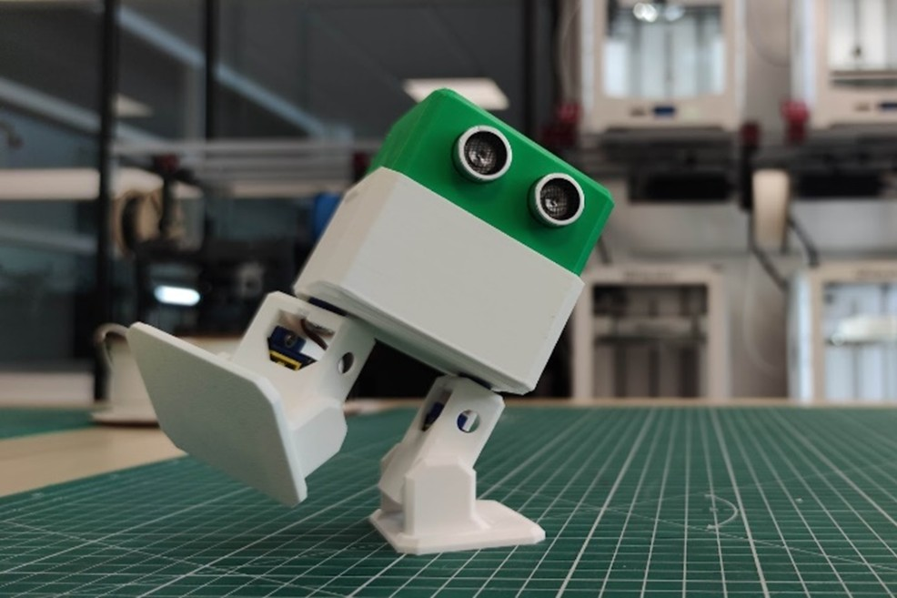

+++
image = "portfolio/otto-mks/icon.png"
showonlyimage = false
date = "2025-06-25T18:00:00+02:00"
title = "OTTO-MKS : un robot pédagogique"
draft = false
weight = 3
+++

Un robot bipède imprimé en 3D, open-source, et pensé pour initier les étudiants aux bases de la robotique, de l’électronique et de la programmation.

<!--more-->

---

## Contexte

Ce projet a été développé en 2024-2025 dans le cadre de mon **projet de fin d’études d’ingénieur à UniLaSalle Amiens**, au sein du **MakerSpace** de l’école.  

Ma mission : **améliorer l’expérience utilisateur** dans cet atelier de prototypage collaboratif, en structurant des projets pédagogiques accessibles, motivants et techniquement cohérents.

C’est dans cette optique qu’est né **OTTO-MKS**, un robot éducatif à construire de A à Z, utilisé comme **support d’apprentissage** pour les premières années.  

---

## Présentation

OTTO-MKS est une version repensée du robot open-source [OTTO DIY](https://www.ottodiy.com/), adaptée aux contraintes d’un usage académique et modernisé pour intégrer de nouvelles fonctionnalités.  

Le projet propose aux étudiants une **expérience complète et concrète** : conception 3D, prototypage électronique, assemblage, programmation et personnalisation.

> L’objectif est d’apprendre par la pratique, dans un cadre bienveillant, progressif… et ludique.

---

## Ce que les étudiants construisent

Chaque robot fonctionne avec :

> **XIAO ESP32-C3** — Microcontrôleur Wi-Fi & Bluetooth, programmable avec Arduino  
> **4 servomoteurs 9g** — Deux jambes, Deux pieds articulés  
> **Capteur HC-SR04** — Monté à l’avant comme des "yeux"  
> **Batterie 9V USB-C rechargeable** - Gestion énergetique simple
> **Buzzer & LED** — retours simples et visibles

L’électronique repose sur une **carte conçue sur mesure** par mon collègue et ami **Adrien Bracq**.
La structure mécanique est **entièrement modélisée sous OnShape**, ce qui permet aux étudiants de la modifier librement.

---

## Une documentation libre et complète

OTTO-MKS est **entièrement open-source** et documenté sur une plateforme dédiée dont j'ai créé les contenus.  
Les étudiants y trouvent :

- Les modèles 3D
- Le guide d’assemblage pas-à-pas
- Les tutoriels pour découvrir les rôles des composants 

> Accès libre à la documentation :  
> [makerspace-amiens.fr/otto-mks](https://makerspace-amiens.fr/otto-mks/)

---

Le tout illustré par mes soins, grâce a des exports d'OnShape, et un passage sous **InkScape** pour rendre tout ça **attrayant** et **ludique** !



---

## Une pédagogie progressive et accessible

Les séances sont organisées autour de **tutoriels interactifs** couvrant chaque étape que les étudiants suivent à leur rythme:

1. **Découverte des composants**
2. **Impression 3D**
3. **Assemblage mécanique et électronique**
4. **Programmation (Arduino)**
5. **Customisation et défis**

Chaque équipe peut ensuite modifier son robot pour participer aux **Ottolympiades** !

> Certains robots ont pris l’apparence de personnages de fiction, d'autres ont été rééquilibrés, renforcés ou dotés de bras articulés.

---

## Les Ottolympiades

Le projet se conclut lors de la **Journée des Projets** par un tournoi convivial : les **Ottolympiades** !
Une série de trois épreuves créatives, dont le réglement est disponible sur la plateforme de documentation :  

> [makerspace-amiens.fr/otto-mks/ottolympiades](https://makerspace-amiens.fr/otto-mks/ottolympiades)  

Ici, la finale de Otto Sumo !



---

J’ai également développé un **système d’arbitrage automatisé** grâce a la pipeline Google Sheets + Google AppSheet, permettant à plusieurs arbitres d’entrer les scores depuis leur téléphone, avec calculs automatiques et affichage en temps réel.

---

>### Outils logiciels
>
>- **OnShape**
>- **[KiCad](https://www.kicad.org)** 
>- **VSCode**
>- **Inkscape**
>- **Google Sheets + Google AppSheet**

---

>### Technologies
>
>- **Impression 3D FDM**
>- **Prototypage électronique**
>- **Conception de PCB**
>- **Programmation embarquée (Arduino)** 
